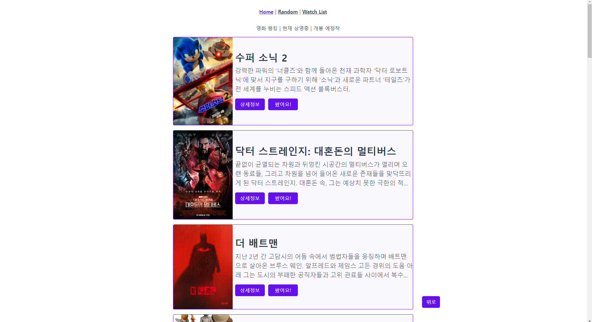
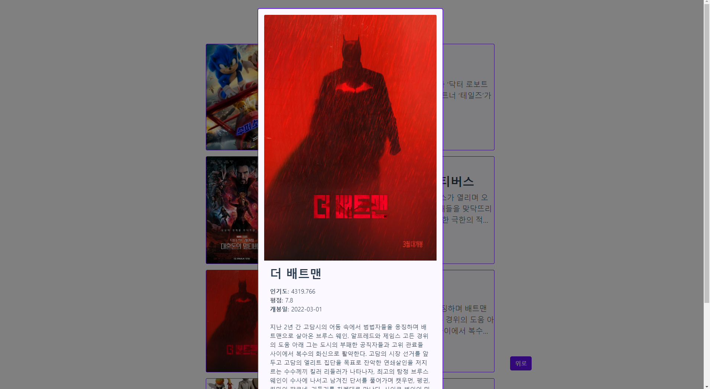
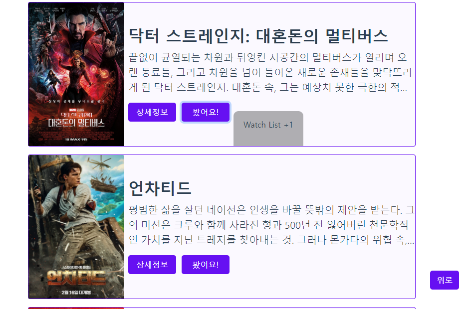
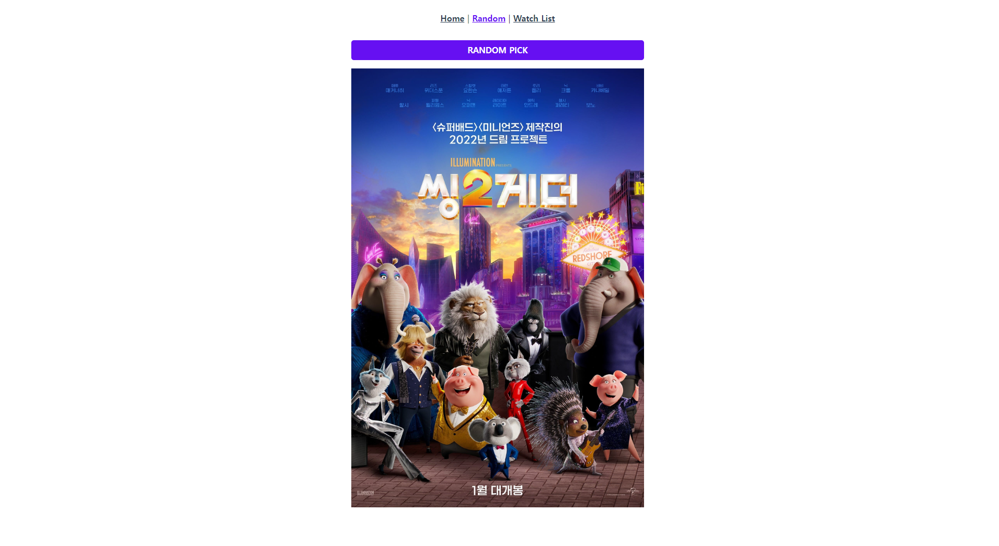
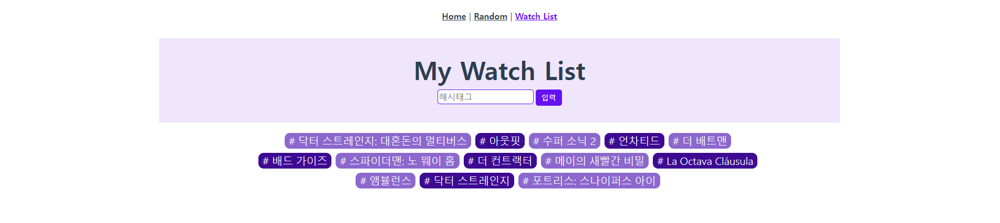

# TMDB API Vue Project

- 승재님과 함께한 프로젝트에 추가로 아래 기능을 덧붙였다.

- HOME

  

  

  - 인피니트 스크롤 구현 => 스크롤 바닥 닿기 직전, TMDB에 다음 페이지 영화들 요청해서 이어붙임

  - 영화 목록 요청 기준 3개 => 인기도, 현재 상영중, 개봉 예정작

  - 영화 상세 정보 버튼 + 모달

  - 봤어요! 버튼 => Watch List 에 해시태그(#) 형태로 추가 및 삭제 + 눌렀을 때 Watch List +1 혹은 -1 확인 창이 잠깐 떴다가 사라짐

    

- RANDOM

  

  - 영화 포스터 클릭하면 상세정보 확인

- WATCH LIST

  

  - 화면 아무데서 엔터누르면 클릭안해도 바로 입력할 수 있도록 함
  - esc 누르면 입력창 초기화
  - 해시태그 더블클릭하면 삭제

- 재밌었던 프로젝트... 뷰 재밌다...

